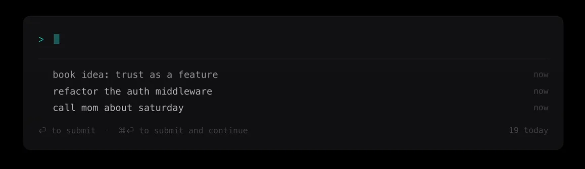

# OCS

[](LICENSE)


Quick capture for macOS. Press ⌥⌘Space anywhere, type, hit Enter. The thought is in your inbox.

Free forever. No account. Local-first. Open source.



## install

### homebrew

```
brew tap optcmdspace/ocs
brew install --cask optcmdspace
```

The cask downloads the signed DMG, copies the app to `/Applications`, and launches it once so the global hotkey is armed.

### direct download

1. Download the latest signed DMG from the [Releases page](../../releases). No account, no sign-up.
2. Drag OCS to your Applications folder.
3. Open OCS once. It runs as an accessory app (no Dock icon, no menu bar item), so it looks like nothing happened. The first launch arms the hotkey.

### one-time setup (either method)

- Free the hotkey: macOS binds ⌥⌘Space to "Show Finder search window" by default. Open System Settings -> Keyboard -> Keyboard Shortcuts -> Spotlight, and uncheck **Show Finder search window**.
- OCS adds itself to Login Items on first launch so the hotkey survives reboots. To opt out, disable it in System Settings -> General -> Login Items.

Requires macOS 14 (Sonoma) or later. Apple silicon and Intel.

## use it

- ⌥⌘Space opens the panel from any app
- Type, Enter to save
- ↓ to view past captures
- Esc dismisses

The hotkey is the entire surface. No dock icon, no menu bar item, no preferences window.

## where the data lives

A local SQLite database at `~/Library/Application Support/OCS/`. The data model is an append-only event log: every capture, edit, and delete is an immutable event you can replay. Plain SQLite, plain markdown export. If the project ever stops, you walk away with your data and a file format that will outlive most software.

## privacy

OCS is local-first. Captures stay on your machine. There is no telemetry by default and no analytics. Crash reports are opt-in. Apart from checking for updates, the app does not send any requests on launch, on save, or on any other action.

The global hotkey is registered with macOS so the panel can open from any app. OCS only reads what you type inside the panel; it does not capture keystrokes from other apps.

## roadmap

- [x] Global hotkey to open the capture panel
- [x] Type and save to a local SQLite store
- [x] List view of past captures, edit and delete
- [x] Signed and notarized DMG
- [ ] Inline tags (`#work`) and dates (`tomorrow`, `friday`)
- [ ] `/find` for substring, tag, and date in a single query
- [ ] Keyboard triage in the list (tag, move, convert)
- [ ] Encrypted sync, opt-in and end-to-end (the only paid product)
- [ ] iOS companion
- [ ] Command-line interface

Pre-1.0. The capture flow is stable; everything else may move.

## transparency

The app is free forever. No upsell, no feature gate, no charging later.

The one paid product is optional encrypted sync across your devices. It's opt-in, end-to-end encrypted, and the only way money flows into this project. You are completely fine without it; most people won't use it.

No venture capital. No advertising. No telemetry by default. The full plain-text version is on [optcmd.space](https://optcmd.space).

## build from source

Requires Xcode 26.4 or later.

```
xcodebuild -scheme OCS -configuration Debug build
```

Or open `OCS.xcodeproj` in Xcode and press ⌘R.

## built on

- [KeyboardShortcuts](https://github.com/sindresorhus/KeyboardShortcuts) by Sindre Sorhus, for the global hotkey.
- [GRDB.swift](https://github.com/groue/GRDB.swift) by Gwendal Roué, for the SQLite store.

## contributing

See [CONTRIBUTING.md](CONTRIBUTING.md). Short version: run `scripts/check-cqrs.sh` and `xcodebuild` before opening a PR.

## license

MIT. See [LICENSE](LICENSE).
